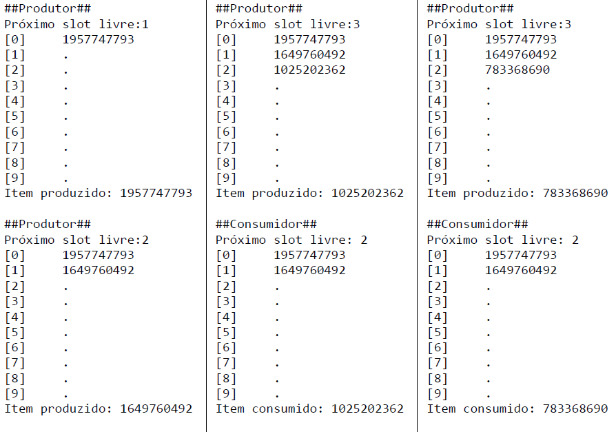
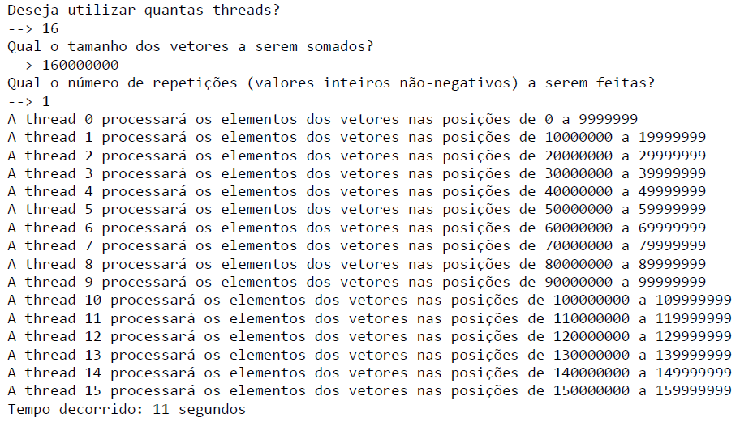
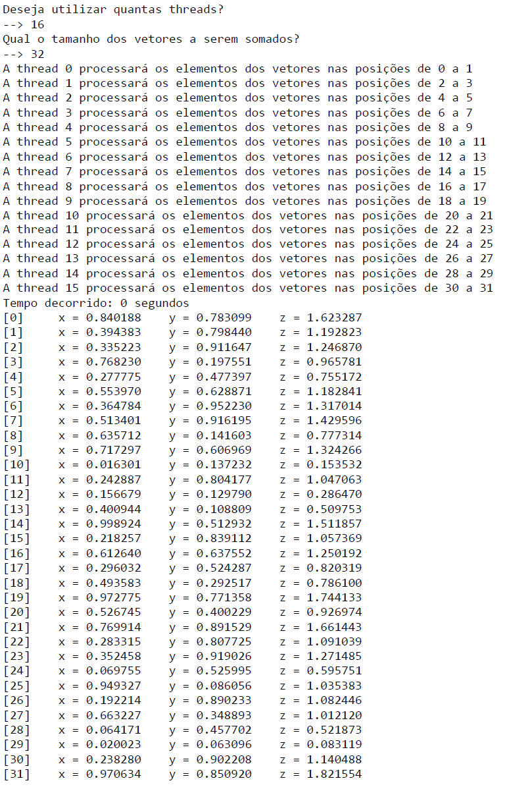

# Trabalho de Sistemas Operacionais

Implementação do trabalho da disciplina de Sistemas Operacionais abordando o assunto principal de gerenciamento de 

Os objetivos deste trabalho são:

•  	Sobre threads:
    <ul>
    <li>Entender como manipular threads usando a biblioteca pthread.h;</li>
    <li>Entender como fazer Inter Process Communication (IPC) entre as threads usando 1) mutex e 2) semáforo;</li>
    <li>Entender como sincronizar as threads de forma que se evitem condições de corrida, deadlock ou starvation;</li>
    <li>Entender a analogia do buffer como uma caixa d’água furada com 𝑀 produtores e 𝑁 consumidores;</li>
    <li>Entender como se aplicam mutexes (Mutual Exclusions) e semáforos usando pthread_mutex_t e sem_t presentes nas bibliotecas pthread.h e semaphore.h; </li>
    <li>Observar o overhead na criação e no escalonamento de threads em tarefas paralelas.
        Para atender aos objetivos, a dupla de alunos deve implementar em linguagem C (só para reforçar, não é C++) dois progra- mas separados que abordam dois problemas diferentes de IPC.</li>
    </ul>

## Programa 1 - Problema de 𝑀 produtores e 𝑁 consumidores

    a.	O usuário deverá inserir em runtime as quantidades de produtores (𝑀) e consumidores (𝑁), além do tama- nho do buffer:

        i.   𝑀 e 𝑁 obviamente devem ser valores positivos, assim como o tamanho do buffer;
        ii.   O buffer é um vetor do tipo int, alocado usando malloc() e deve ser preenchido com -1.

    b.   Os produtores e os consumidores deverão inserir/retirar elementos do buffer indefinidamente. O programa só terá a sua execução finalizada de maneira involuntária via CTRL-C. As regras de produção/consumo são:

        i.   Os itens serão produzidos/consumidos usando a ordenação FILO (first-in, last-out), como em uma pilha. Em outras palavras, deve-se armazenar qual foi o último slot de buffer utilizado;
        ii.   O processo de produção é simplesmente inserir um valor inteiro aleatório positivo e incrementar o contador de slots utilizados. Porém, utilize sleep(rand() % 5) para simular uma produção que demora entre zero e dois segundos;
        iii.   Como não há destinação para os itens consumíveis, o processo de consumo também será simu- lado. Para tanto, o item consumido assumirá o valor -1 e o contador de slots utilizados deve ser decrementado. Utilize sleep(rand() % 2), para simular um consumo que provavelmente será mais rápido do que a produção;
        iv.   Após a produção/consumo do item, o buffer deverá ser impresso na tela e disposto na vertical, com um elemento por linha. Considere -1 como vazio e essas posições do buffer devem ser impressas apenas como um espaço em branco.

    c.	Deve-se, obrigatoriamente, utilizar semáforos para sinalizar produtores e consumidores que podem realizar a sua tarefa. Portanto, os 𝑀 produtores e os 𝑁 consumidores deverão ser executados assincronamente, onde cada um deles possui a sua própria thread.

    d.	Dicas:
        i.	Implemente como variáveis globais:
            1.	Um semáforo para sinalizar os produtores;
            2.	Um semáforo para sinalizar os consumidores;
            3.	Um mutex para o contador de slots ocupados;
            4.	A variável que armazena o tamanho do buffer;
            5.	A variável que armazena o número de slots ocupados (em outras palavras, indica o próximo slot livre).

    e.	Saída de exemplo:

 
 

## Programa 2 - Problema 𝘮𝘶𝘭𝘵𝘪𝘵𝘩𝘳𝘦𝘢𝘥 de soma de vetores

    a.	Considere três vetores, x, y e z, todos de tamanho fixo: 160 milhões de elementos (16 × 107) em cada vetor;

    b.	Os vetores são do tipo float e devem ser alocados usando malloc() antes de se iniciar o processo;

    c.	O número de threads (𝑁) deve ser definido em runtime pelo usuário. A única restrição é a de que 16 × 107 deve ser um múltiplo de 𝑁, pois os vetores serão divididos em 𝑁 partes, uma para cada thread. Serão N threads para popular o vetor X, N threads para popular o vetor Y e N threads para calcular o vetor z = x+y;

    d.	Como o processamento paralelo em 𝑁 partes, deve-se criar 𝑁 mutexes para controlar a entrada na região crítica no seu código;

    e.	Deve haver a thread void* preencheVetores(void* argPtr) que será responsável por preencher os vetores x e y com valores aleatórios entre zero e um, cujos parâmetros de entrada são:

        i.	   float* vetor – ponteiro para o início do vetor que será preenchido;
        ii.	   unsigned int posInicial – posição inicial de preenchimento do vetor;
        iii.   unsigned int posFinal – posição final de preenchimento do vetor;
        iv.	   unsigned int contMutexThread – contador que indicará qual dos 𝑁 mutexes deve ser utilizado para controlar a região crítica da thread;

    f.	Deve haver a thread void* somaVetores(void* argPtr) que será responsável por produzir o vetor z a partir da soma x e y. Os parâmetros de entrada são:

        i.	  float* x – ponteiro para o início do vetor x;
        ii.	  float* y – ponteiro para o início do vetor y;
        iii.  float* z – ponteiro para o início do vetor z;
        iv.	  unsigned int posInicial – posição inicial de preenchimento do vetor;
        v.	  unsigned int posFinal – posição final de preenchimento do vetor;
        vi.	  unsigned int contMutexThread – contador que indicará qual dos 𝑁 mutexes deve ser utilizado

    g.	O código deve mostrar na tela quais as posições dos vetores que serão processadas por cada thread;

    h.	Deve-se cronometrar o tempo de execução. Para isso, utilize um timer do tipo time_t (que tem um segundo de resolução) e é implementado em time.h. O tempo de cronometragem deve ser entre antes de se iniciar o processamento e depois de se finalizarem todas as threads.

        i.   Dicas:
        i.   Implemente os mutexes como um vetor de 𝑁 posições a ser alocado via malloc();
        ii.  Os mutexes os vetores x, y e z devem ser implementados como variáveis globais, que serão compartilhadas entre todas as threads em execução;
        iii. Por limitação da biblioteca pthread.h, as threads só podem ter um argumento de entrada do tipo void, como vocês podem ver nos protótipos acima. Por isso, deve-se criar dois structs (um para cada tipo de thread) que servirão para passar os parâmetros.

    j.	Saída de exemplo:

    k.	Saída de exemplo (com impressão apenas para depuração):

